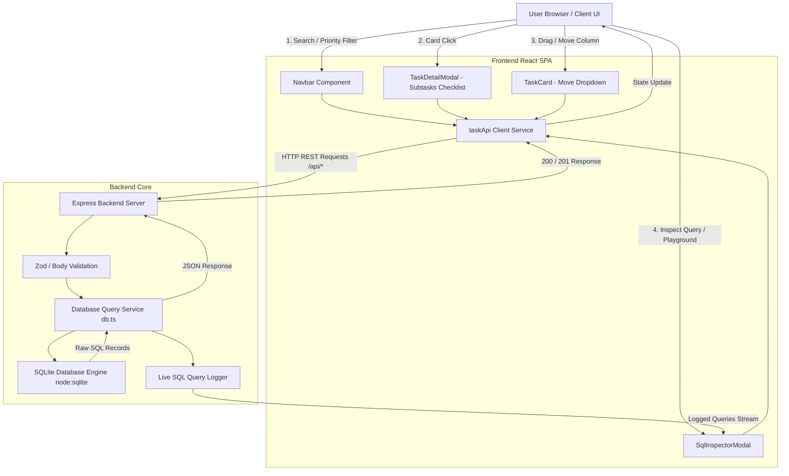
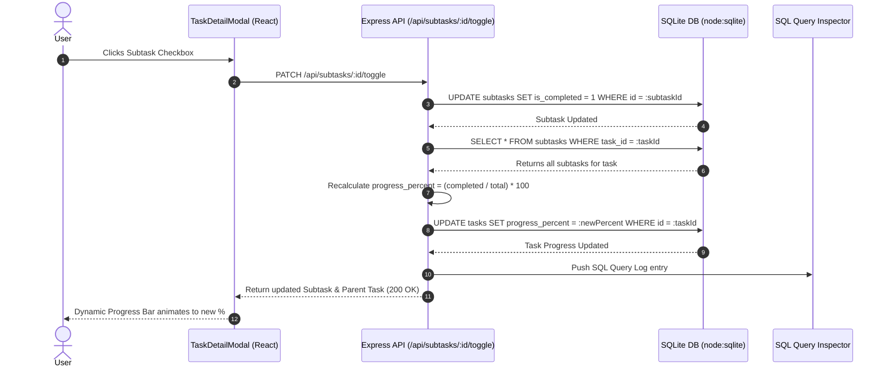

# TaskFlow — Full-Stack Task Management Board

A modern, full-stack Trello-like Task Management Application built as a Full-Stack Developer Take-Home Assignment.

---

## 🌐 Live Demo & Submission Links

- **Live Production Application**: [https://taskflow-full-stack-assignment.onrender.com](https://taskflow-full-stack-assignment.onrender.com)
- **GitHub Repository**: [https://github.com/Premdeep-Gupta/taskflow-full-stack-assignment.git](https://github.com/Premdeep-Gupta/taskflow-full-stack-assignment.git)

---

## 📋 Overview

**TaskFlow** allows small teams to organize tasks into columns (`To Do`, `In Progress`, `Done`), filter by priority (`High`, `Medium`, `Low`), manage interactive subtasks checklists, inspect live SQL queries, and persist all changes in a relational SQLite database.

It demonstrates clean architecture with an Express backend, native SQLite database using raw SQL queries (no ORM, as per evaluation criteria), a responsive React + Vite frontend with Tailwind CSS, and comprehensive automated test coverage with Vitest + Supertest.

---

## 🔄 Application Workflow Diagrams

### 1. System Architecture & End-to-End Data Flow



---

### 2. Task & Subtask Progress Auto-Recalculation Workflow



---

## ✨ Core & Ultra Pro Features

- **Kanban Board Canvas**: Clean 3-column layout (`To Do`, `In Progress`, `Done`) with priority badges, user avatars (`AD`, `RK`, `JD`, `SK`), comment/attachment counters, and column task counters.
- **Interactive Subtasks Checklist**: Open task drawer modal to view, check off, or dynamically add subtasks. Completing subtasks automatically recalculates and animates the task's progress bar (`0%` ➔ `50%` ➔ `100%`).
- **Live SQL Query Inspector & Playground**: Click `<> SQL Inspector` to view live logged SQL execution times or run raw custom `SELECT`, `INSERT`, `UPDATE`, `DELETE` queries directly in the SQL Sandbox.
- **Task Management**:
  - **Create Task**: Form modal with title, description, priority, and column selection.
  - **Edit Task**: Edit existing task title, description, and priority.
  - **Delete Task**: Delete confirmation modal with persistent deletion.
  - **Move Task**: Move tasks seamlessly between columns via dropdown or direct API endpoint.
- **Header Search & Filtering**: Instant title/description search bar (`🔍 Search tasks...`) and priority filter dropdown (`All`, `High`, `Medium`, `Low`).
- **One-Click DB Reset**: `🔄 Reset DB` button to reset SQLite sequence counters and re-seed 13 sample tasks with subtasks.

---

## 🛠️ Tech Stack

- **Frontend**: React 19, Vite, Tailwind CSS v4, Lucide React icons
- **Backend**: Node.js, Express, CORS
- **Database**: SQLite (`node:sqlite` native `DatabaseSync` API) with raw SQL
- **Testing**: Vitest, Supertest
- **Dev Runner**: `tsx` (TypeScript server execution)

---

## 🏗️ Project Architecture

```
taskflow/
├── backend/
│   ├── database/
│   │   ├── schema.sql           # Mandatory CREATE TABLE statements for boards, columns, tasks, subtasks
│   │   ├── seed.js              # Initial database seeding script
│   │   ├── taskflow.db          # Relational SQLite database file
│   │   └── db.ts                # Raw SQL query service layer & SQL logger
│   ├── src/
│   │   └── app.ts               # Express REST API endpoints & route handlers
│   └── tests/
│       ├── task.test.ts         # Validation & task move endpoint tests
│       └── database.test.ts     # Raw SQL query tests
├── src/
│   ├── components/
│   │   ├── Board.tsx            # Kanban board canvas
│   │   ├── Column.tsx           # Column container
│   │   ├── TaskCard.tsx         # Task item card with progress bar & action buttons
│   │   ├── TaskDetailModal.tsx   # Interactive subtasks checklist modal
│   │   ├── SqlInspectorModal.tsx # Live SQL Inspector & Playground Sandbox
│   │   ├── TaskFormModal.tsx    # Create & Edit task modal
│   │   ├── DeleteConfirmModal.tsx# Delete confirmation dialog
│   │   ├── ErrorMessage.tsx     # Global error banner
│   │   ├── Navbar.tsx           # Search, priority filter & header actions
│   │   └── StatsBar.tsx         # Live SQLite metrics banner
│   ├── services/
│   │   └── taskApi.ts           # Frontend HTTP API client
│   ├── App.tsx                  # Root state management & page layout
│   ├── types.ts                 # TypeScript interfaces
│   └── main.tsx                 # React entry point
├── server.ts                    # Full-stack Express + Vite server entry point
├── package.json
└── README.md
```

---

## 🗄️ Relational Database Schema (`backend/database/schema.sql`)

```sql
CREATE TABLE IF NOT EXISTS boards (
    id INTEGER PRIMARY KEY AUTOINCREMENT,
    name TEXT NOT NULL,
    created_at DATETIME DEFAULT CURRENT_TIMESTAMP
);

CREATE TABLE IF NOT EXISTS columns (
    id INTEGER PRIMARY KEY AUTOINCREMENT,
    board_id INTEGER NOT NULL,
    name TEXT NOT NULL,
    position INTEGER NOT NULL,
    FOREIGN KEY (board_id) REFERENCES boards(id) ON DELETE CASCADE
);

CREATE TABLE IF NOT EXISTS tasks (
    id INTEGER PRIMARY KEY AUTOINCREMENT,
    column_id INTEGER NOT NULL,
    title TEXT NOT NULL,
    description TEXT,
    priority TEXT NOT NULL DEFAULT 'Medium',
    progress_percent INTEGER DEFAULT 0,
    assignee_name TEXT DEFAULT 'Alex Doe',
    assignee_avatar TEXT DEFAULT 'AD',
    comments_count INTEGER DEFAULT 1,
    attachments_count INTEGER DEFAULT 2,
    created_at DATETIME DEFAULT CURRENT_TIMESTAMP,
    updated_at DATETIME DEFAULT CURRENT_TIMESTAMP,
    FOREIGN KEY (column_id) REFERENCES columns(id) ON DELETE CASCADE
);

CREATE TABLE IF NOT EXISTS subtasks (
    id INTEGER PRIMARY KEY AUTOINCREMENT,
    task_id INTEGER NOT NULL,
    title TEXT NOT NULL,
    is_completed INTEGER DEFAULT 0,
    created_at DATETIME DEFAULT CURRENT_TIMESTAMP,
    FOREIGN KEY (task_id) REFERENCES tasks(id) ON DELETE CASCADE
);
```

---

## 🔍 Non-Trivial SQL Queries

### Query 1: Tasks Per Column Distribution
Uses `LEFT JOIN` and `GROUP BY` to aggregate task counts per column:
```sql
SELECT
    c.id,
    c.name,
    COUNT(t.id) AS task_count
FROM columns c
LEFT JOIN tasks t
    ON c.id = t.column_id
WHERE c.board_id = 1
GROUP BY c.id, c.name
ORDER BY c.position;
```

### Query 2: Filter Tasks by Priority (Newest First)
Uses `JOIN` to query tasks filtered by priority:
```sql
SELECT
    t.id,
    t.title,
    t.description,
    t.priority,
    t.progress_percent,
    c.name AS column_name
FROM tasks t
JOIN columns c
    ON t.column_id = c.id
WHERE LOWER(t.priority) = LOWER(?)
ORDER BY t.created_at DESC;
```

---

## 📡 REST API Endpoints

| Method | Endpoint | Description | Sample Payload |
| :--- | :--- | :--- | :--- |
| **GET** | `/api/boards/1` | Fetch board with columns, tasks & subtasks | - |
| **GET** | `/api/stats/tasks-per-column` | Execute Query 1 (tasks per column count) | - |
| **GET** | `/api/sql-logs` | Fetch live logged SQL queries | - |
| **POST** | `/api/sql-run` | Run custom raw SQL query in SQL Sandbox | `{"query": "SELECT * FROM tasks;"}` |
| **POST** | `/api/tasks` | Create task (Strict title validation) | `{"columnId": 1, "title": "Build API", "priority": "High"}` |
| **PUT** | `/api/tasks/:id` | Update task details | `{"title": "Updated", "priority": "Medium"}` |
| **PATCH** | `/api/tasks/:id/move` | Move task to target column | `{"columnId": 2}` |
| **PATCH** | `/api/subtasks/:id/toggle` | Toggle subtask completion status | - |
| **POST** | `/api/tasks/:id/subtasks` | Add new subtask to task | `{"title": "Define Express routes"}` |
| **POST** | `/api/reset` | Reset DB and re-seed sample data | - |
| **DELETE**| `/api/tasks/:id` | Delete task | - |

---

## 🧪 Testing

Automated test suite using Vitest + Supertest:
```bash
npm test
```
- **Empty Title Validation**: Enforces HTTP `400 Bad Request` on empty task title.
- **Move Task Endpoint**: Verifies `column_id` updates cleanly via `PATCH /api/tasks/:id/move`.
- **SQL Aggregations**: Verifies SQL Query 1 (`tasks-per-column`) aggregates column distribution accurately.

---

## 🚀 Running Locally

1. **Install Dependencies**:
   ```bash
   npm install
   ```

2. **Start Dev Server**:
   ```bash
   npm run dev
   ```
   Open `http://localhost:3000` in your browser.

---

## 🌐 Live Demo & Submission Links

- **Live Production Application**: [https://taskflow-full-stack-assignment.onrender.com](https://taskflow-full-stack-assignment.onrender.com)
- **GitHub Repository**: [https://github.com/Premdeep-Gupta/taskflow-full-stack-assignment.git](https://github.com/Premdeep-Gupta/taskflow-full-stack-assignment.git)

---

## ⏱️ Time Spent & Learning Outcomes

- **Time Spent**: ~2.5 hours
- **Key Learnings**: Utilizing native Node 22 SQLite (`node:sqlite`) for zero-dependency native SQL execution, implementing clean RESTful API endpoint design with Supertest suite, and crafting responsive Tailwind CSS Kanban UI layouts.

